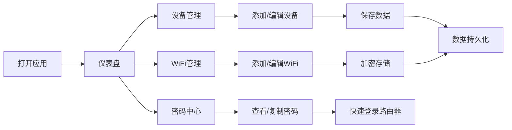

## 1. 产品概述
家庭网络管理工具，帮助用户集中管理家中所有网络设备和WiFi信息，解决设备IP记不住、WiFi密码容易忘、登录路由器后台需要反复查找密码等痛点。

- 主要用途：集中管理家庭网络设备信息、WiFi密码加密存储、路由器后台密码快速查看
- 目标用户：家庭网络管理员、普通家庭成员
- 产品价值：提高家庭网络维护效率，避免遗忘重要网络信息

## 2. 核心功能

### 2.1 用户角色
无需复杂角色体系，单用户模式，所有功能对使用者开放。

### 2.2 功能模块
1. **设备管理**：录入、编辑、删除网络设备，查看设备列表
2. **WiFi管理**：录入、编辑、删除WiFi信息，支持2.4G/5G频段标注
3. **密码查看**：安全查看WiFi密码和路由器后台密码，支持复制功能
4. **数据持久化**：本地加密存储，保证数据安全

### 2.3 页面详情
| 页面名称 | 模块名称 | 功能描述 |
|-----------|-------------|---------------------|
| 仪表盘 | 概览统计 | 设备总数、WiFi数量概览，快捷操作入口 |
| 设备管理 | 设备列表 | 设备卡片展示，支持筛选、搜索、添加、编辑、删除 |
| 设备管理 | 设备表单 | 录入设备名称、类型、IP地址、MAC地址、摆放位置、备注 |
| WiFi管理 | WiFi列表 | WiFi卡片展示，显示SSID、频段、密码隐藏状态 |
| WiFi管理 | WiFi表单 | 录入SSID、密码、频段（2.4G/5G/双频）、备注 |
| 密码中心 | 密码查看 | 安全查看密码，一键复制，路由器后台快速访问 |

## 3. 核心流程

### 3.1 主要用户流程
1. 用户打开应用，进入仪表盘查看概览
2. 用户点击"添加设备"，填写设备信息后保存
3. 用户点击"添加WiFi"，填写WiFi信息（密码加密存储）
4. 用户需要登录路由器时，进入密码中心，查看并复制路由器密码
5. 用户可随时编辑或删除设备/WiFi信息

## 4. 用户界面设计

### 4.1 设计风格
- **主色调**：深蓝色（#0f172a）作为背景，营造科技感
- **辅助色**：青色（#06b6d4）用于强调按钮和关键信息
- **强调色**：翠绿色（#10b981）用于成功状态，橙色（#f59e0b）用于2.4G标签，蓝紫色（#8b5cf6）用于5G标签
- **按钮风格**：圆角8px，悬浮时轻微上移和阴影变化
- **字体**：展示字体使用 Space Grotesk，正文字体使用 Inter
- **布局风格**：卡片式布局，深色主题，毛玻璃效果增强层次感
- **图标**：使用 lucide-react 图标库，统一线性风格

### 4.2 页面设计概述
| 页面名称 | 模块名称 | UI元素 |
|-----------|-------------|-------------|
| 仪表盘 | 概览统计 | 顶部统计卡片网格，快捷操作按钮，最近添加的设备列表 |
| 设备管理 | 设备列表 | 网格布局的设备卡片，每个卡片显示设备图标、名称、IP、位置，顶部有搜索和筛选栏 |
| 设备管理 | 设备表单 | 模态框表单，左侧图标选择，右侧输入字段，底部操作按钮 |
| WiFi管理 | WiFi列表 | 卡片展示SSID、频段标签、密码隐藏显示，查看密码按钮 |
| 密码中心 | 密码查看 | 密码隐藏显示，点击眼睛图标显示，一键复制按钮，路由器访问链接 |

### 4.3 响应性
- 桌面端：三列网格布局，侧边导航
- 平板端：两列网格布局，顶部导航
- 移动端：单列布局，底部Tab导航
- 所有交互元素支持触摸操作，按钮最小高度44px

## 5. 数据安全设计
- WiFi密码和路由器后台密码使用AES加密存储
- 本地数据文件加密保护
- 查看密码需要确认操作
- 支持导出加密备份文件
