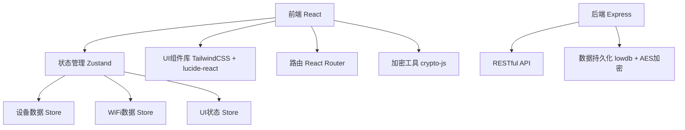
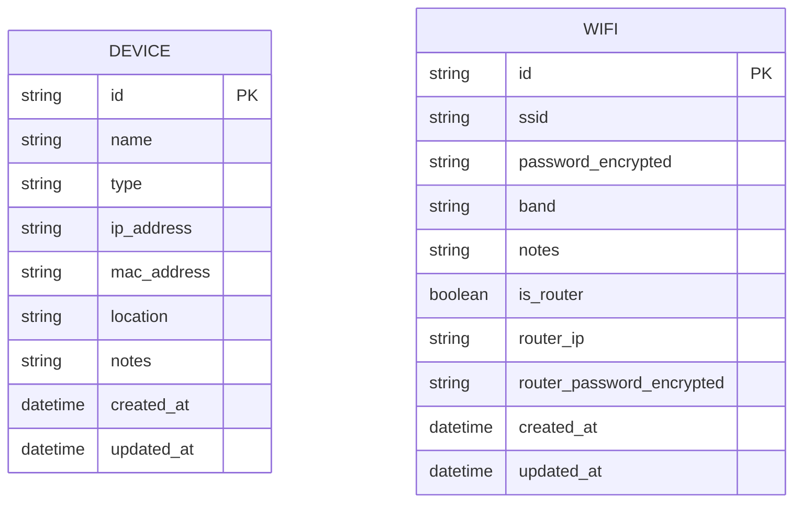

## 1. 架构设计



## 2. 技术描述
- **前端**：React@18 + TypeScript + Vite + TailwindCSS@3 + zustand + react-router-dom + lucide-react + crypto-js
- **后端**：Express@4 + TypeScript + lowdb（本地JSON数据库）
- **加密**：crypto-js AES加密存储密码
- **图标**：lucide-react
- **初始化工具**：vite-init

## 3. 技术选型说明
- **纯前端模式**：由于是家庭个人使用场景，采用本地存储模式，后端仅作为静态文件服务和可选的API层
- **lowdb**：轻量级JSON数据库，适合本地单用户场景，无需安装数据库服务
- **crypto-js**：AES加密确保WiFi密码等敏感数据在本地存储时的安全性
- **zustand**：轻量级状态管理，比Redux更简单，适合中小规模应用

## 4. 目录结构
```
t:\zijie\28/
├── src/
│   ├── components/          # 可复用组件
│   │   ├── DeviceCard.tsx
│   │   ├── WiFiCard.tsx
│   │   ├── DeviceForm.tsx
│   │   ├── WiFiForm.tsx
│   │   ├── Layout.tsx
│   │   ├── Sidebar.tsx
│   │   ├── StatCard.tsx
│   │   └── PasswordModal.tsx
│   ├── pages/               # 页面组件
│   │   ├── Dashboard.tsx
│   │   ├── Devices.tsx
│   │   ├── WiFi.tsx
│   │   └── Passwords.tsx
│   ├── store/               # Zustand状态管理
│   │   └── useStore.ts
│   ├── utils/               # 工具函数
│   │   ├── encryption.ts    # AES加密工具
│   │   ├── storage.ts       # 本地存储工具
│   │   └── mockData.ts      # 模拟数据
│   ├── types/               # TypeScript类型定义
│   │   └── index.ts
│   ├── App.tsx
│   ├── main.tsx
│   └── index.css
├── api/                     # 后端代码（可选）
│   └── server.ts
├── shared/                  # 共享类型
│   └── types.ts
├── public/                  # 静态资源
├── vite.config.ts
├── tsconfig.json
├── tailwind.config.js
├── postcss.config.js
└── package.json
```

## 5. 路由定义
| 路由 | 页面 | 用途 |
|-------|------|-------|
| / | Dashboard | 仪表盘 - 概览统计 |
| /devices | Devices | 设备管理页面 |
| /wifi | WiFi | WiFi管理页面 |
| /passwords | Passwords | 密码中心页面 |

## 6. 数据模型

### 6.1 实体关系图


### 6.2 数据类型定义
```typescript
// 设备类型
export type DeviceType = 'router' | 'switch' | 'nas' | 'speaker' | 'camera' | 'tvbox' | 'other';

// WiFi频段
export type WiFiBand = '2.4G' | '5G' | 'dual';

// 设备接口
export interface Device {
  id: string;
  name: string;
  type: DeviceType;
  ip_address?: string;
  mac_address?: string;
  location: string;
  notes?: string;
  created_at: string;
  updated_at: string;
}

// WiFi接口
export interface WiFi {
  id: string;
  ssid: string;
  password_encrypted: string;
  band: WiFiBand;
  notes?: string;
  is_router: boolean;
  router_ip?: string;
  router_password_encrypted?: string;
  created_at: string;
  updated_at: string;
}

// 应用状态
export interface AppState {
  devices: Device[];
  wifis: WiFi[];
  loading: boolean;
  encryptionKey: string | null;
}
```

### 6.3 设备类型图标映射
| 类型值 | 显示名称 | 图标 |
|---------|----------|------|
| router | 路由器 | Router |
| switch | 交换机 | Network |
| nas | NAS存储 | HardDrive |
| speaker | 智能音箱 | Speaker |
| camera | 摄像头 | Camera |
| tvbox | 电视盒子 | Monitor |
| other | 其他 | Wifi |

## 7. 加密方案
- **加密算法**：AES-256-CBC
- **密钥管理**：用户设置主密码，通过PBKDF2派生加密密钥
- **存储位置**：加密后的数据存储在 localStorage 或 lowdb JSON文件中
- **密码字段**：WiFi密码、路由器后台密码均加密存储

## 8. API定义（可选后端模式）
```typescript
// 设备API
GET /api/devices          // 获取设备列表
POST /api/devices         // 添加设备
PUT /api/devices/:id      // 更新设备
DELETE /api/devices/:id   // 删除设备

// WiFi API
GET /api/wifis            // 获取WiFi列表
POST /api/wifis           // 添加WiFi
PUT /api/wifis/:id        // 更新WiFi
DELETE /api/wifis/:id     // 删除WiFi
POST /api/wifis/:id/decrypt  // 解密获取密码（需要验证）
```

## 9. 安全设计
1. **前端加密**：密码在存储前就进行AES加密，即使数据库文件泄露也无法直接读取
2. **主密码保护**：首次使用需要设置主密码，所有加密操作基于主密码派生的密钥
3. **内存安全**：解密后的密码仅在内存中短暂存在，不持久化
4. **剪贴板安全**：复制密码后定时清空剪贴板内容
5. **密码查看确认**：查看敏感密码时需要二次确认操作
